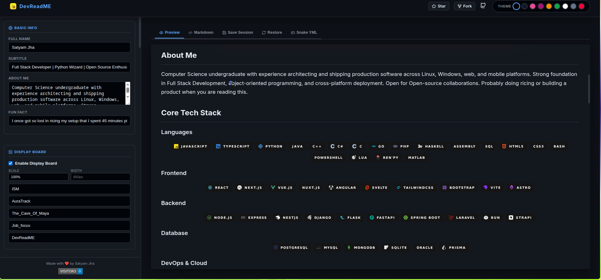
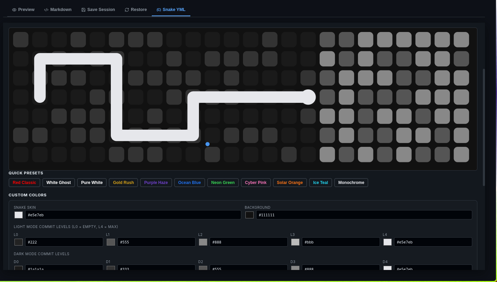
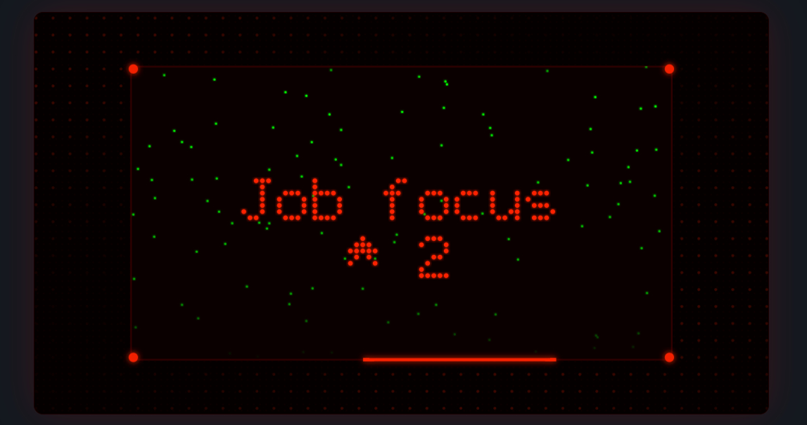

# 🚀 DevReadME

**The most visually expressive GitHub profile README generator out there.**

Most README generators give you a form and spit out some badges. DevReadME gives you a live preview, a cinematic display board, animated snake customization, themed UI, and a session save system, all in one place, no account needed.

<p align="center">
  <a href="https://dev-readme.netlify.app"><strong>✨ Try it live →</strong></a>
</p>

---

## 🤔 Why DevReadME is Different

There are plenty of README generators. Most of them feel like filling out a tax form. DevReadME was built to feel like a creative tool.

- ⚡ Everything updates in real time as you type
- 👀 You see exactly what your profile will look like before you copy anything
- 🔗 The generated markdown uses real GitHub-compatible widgets and APIs
- 🐍 You can customize your contribution snake animation down to individual commit level colors
- 💾 Your work saves automatically in your browser, and you can export and restore sessions across devices
- 🎨 Nine hand-crafted themes change the entire editor feel, not just the output

---

## ✨ Features

### 🖥️ Live Preview
See your README render in real time as you fill in your details. No refresh, no guessing.

### 📟 Display Board
A retro LED-style animated board that cycles through your pinned project names with matrix rain effects, glowing borders, and scrolling text. It renders as a dynamic SVG served from a Netlify function.

### 🐍 Contribution Snake with Full Color Control
Customize your GitHub contribution snake with a color picker for the snake, the background, and all five commit density levels for both light and dark mode. Choose from presets like Gold Rush, Cyber Pink, or Ocean Blue, or build your own palette. The Snake YML tab generates the exact GitHub Actions workflow you need.

### 📊 Stats and Widgets
Toggle GitHub stats, streak stats, activity graph, profile metrics, top languages, LeetCode heatmap, LeetCode contest stats, and Codeforces stats. Each widget has independent scale, width, height, and offset controls.

### 🛠️ Skills Database
Over 200 skills across Languages, Frontend, Backend, Database, DevOps, Mobile, AI/Data, Design Tools, Editors and OS, Productivity, Games, and more.

### ➕ Custom Skill Categories
Create your own skill sections with custom names and icons for things the built-in list does not cover.

### 🔀 Section Ordering
Reorder sections to control the exact layout of your README output.

### 🎨 Nine Themes

| Theme | Feel |
|---|---|
| 🖤 Elegant Black | Red accent on pure black |
| 🔷 Glassmorphic | Sky blue on dark slate |
| 🌈 Colorful | Radical pink and purple |
| 🌊 Vibe Coded | Synthwave purple |
| 🟠 Game Orange | Gruvbox warm orange |
| 💚 Green + White | Green on deep green |
| ⬜ Black + White | Pure monochrome |
| 🩶 Slate Minimal | Muted and clean slate |
| 🔴 Neon Red | Neon red on near-black |

### 💾 Save and Restore Sessions
Your progress auto-saves in your browser. To back it up or move to another machine, copy the session blob from the Save Session tab and paste it into the Restore tab anywhere. No login, no cloud, no account.

---

## 📸 Screenshots

| | | |
|---|---|---|
| **🖤 Editor with Elegant Black theme** | **🐍 Snake YML with color presets** | **📟 Display Board preview** |
|  |  |  |

🌐 Live site: [dev-readme.netlify.app](https://dev-readme.netlify.app)

---

## 📖 How to Use

1. 🌐 Open [dev-readme.netlify.app](https://dev-readme.netlify.app)
2. ✏️ Fill in your name, subtitle, about section, and GitHub username in the sidebar
3. 🛠️ Select your skills or create custom categories
4. 📊 Toggle the widgets you want under Metrics and Animations
5. 📟 Add your repo names to the Display Board if you want the animated board
6. 🎨 Pick a theme from the header
7. 📋 Switch to the Markdown tab and click Copy MD
8. 🚀 Go to `github.com/your-username/your-username`, open `README.md`, select all, paste, and commit

### 🐍 Setting Up the Contribution Snake

1. Go to the Snake YML tab in the editor
2. Pick a color preset or customize your own
3. Click Copy YML
4. In your profile repo create `.github/workflows/snake.yml` and paste the content
5. Go to Settings > Actions > General > Workflow permissions and enable Read and write
6. Go to Actions > Generate Snake > Run workflow
7. It creates an `output` branch with your SVG files and runs daily after that

---

## 📁 Project Structure

```
DevReadME/
├── 📄 index.html
├── 📄 vite.config.js
├── 📄 package.json
├── 📄 bun.lock
├── 📄 eslint.config.js
├── 📁 public/
│   ├── 🖼️ favicon.png
│   └── 🖼️ logo.png
├── 📁 netlify/
│   └── 📁 functions/
│       └── 📄 displayboard.js
└── 📁 src/
    ├── 📄 main.jsx
    ├── 📄 App.jsx
    ├── 📄 App.css
    ├── 📄 index.css
    ├── 📄 CursorBubbles.jsx
    ├── 📁 assets/
    ├── 📁 components/
    └── 📁 utils/
```

---

## 🏃 Running Locally

You need [Bun](https://bun.sh) and [Node.js](https://nodejs.org) installed.

**📦 Clone and install**

```bash
git clone https://github.com/dev-satyamjha/DevReadME.git
cd DevReadME
bun install
```

**🚀 Start the dev server**

```bash
bun run dev
```

The display board API mock runs automatically via the Vite plugin so the board preview works locally without Netlify.

**⚡ Run with Netlify functions locally**

```bash
bun add -g netlify-cli
bunx netlify dev
```

This runs the actual `displayboard.js` serverless function the same way Netlify does in production.

---

## 🤝 Contributing

Contributions are welcome. If you want to add skills, fix a bug, improve a theme, or suggest a feature, here is how to do it.

**💡 Areas where help is appreciated**

- 🛠️ Adding more skills to the database
- 🎨 New theme ideas
- 📱 Mobile layout improvements
- 🔌 More widget integrations

---

## 🧰 Tech Stack

| Layer | Tech |
|---|---|
| ⚛️ Frontend | React + Vite |
| 🎨 Styling | Custom CSS with theme variables |
| 🎞️ Animations | Hand-built SVG animations |
| ☁️ Serverless | Netlify Functions |
| 🐍 Snake workflow | GitHub Actions |
| 📦 Package manager | Bun |
| 🚀 Deployment | Netlify |

---

## ⭐ Giving a Star

If DevReadME saved you time or you just like what it does, a star on the repo helps other developers find it and means a lot.

---

<p align="center">Made with ❤️ by <a href="https://github.com/dev-satyamjha">Satyam Jha</a></p>